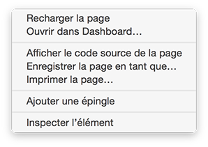
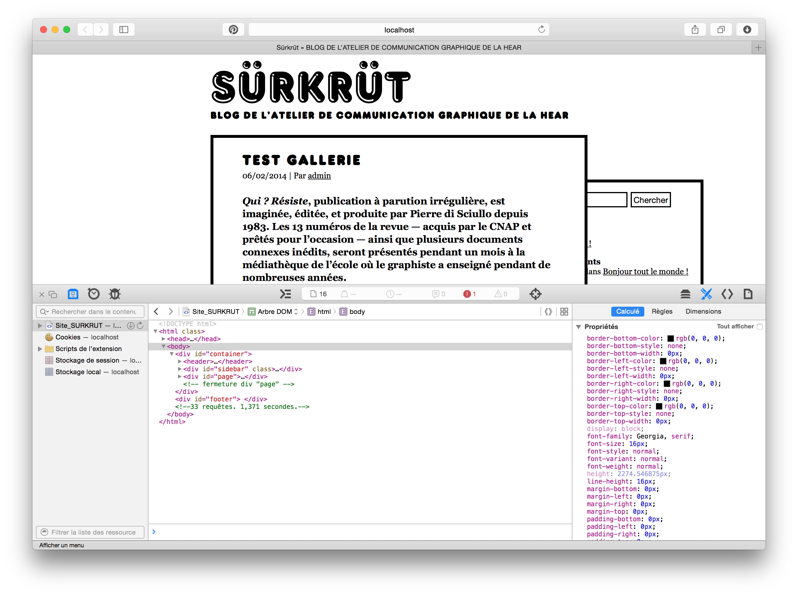
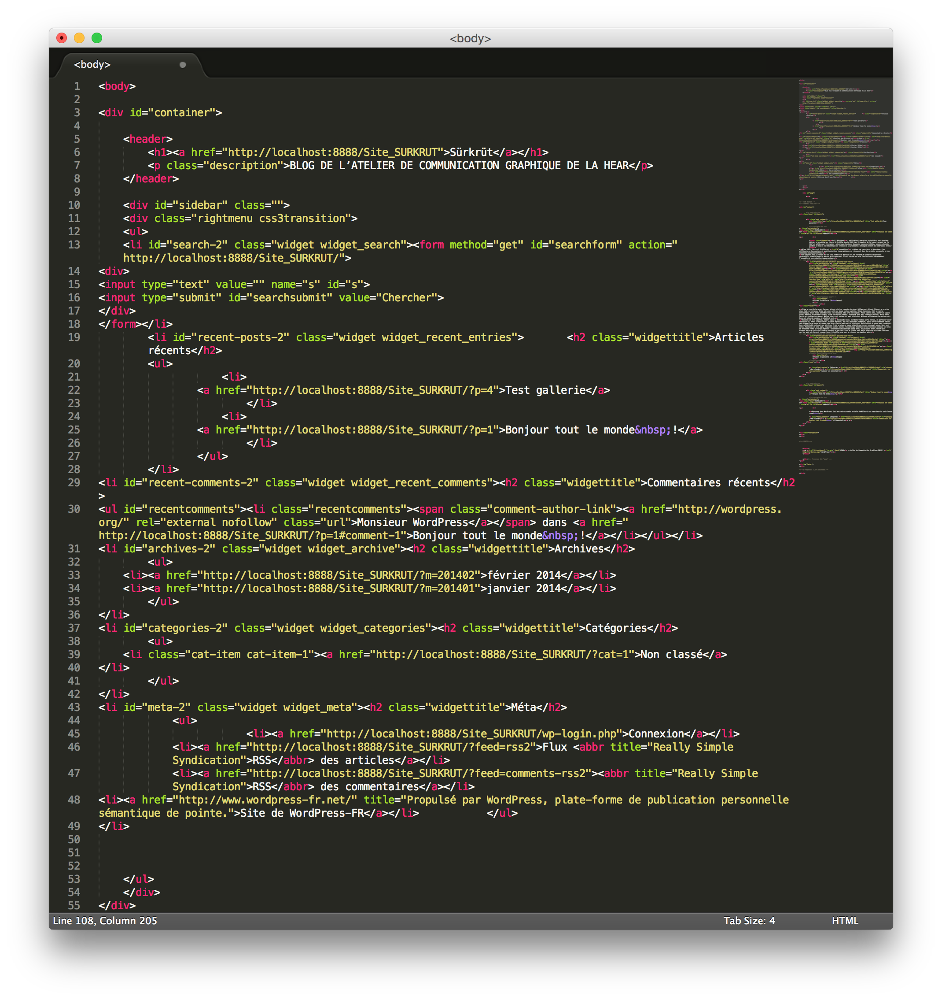
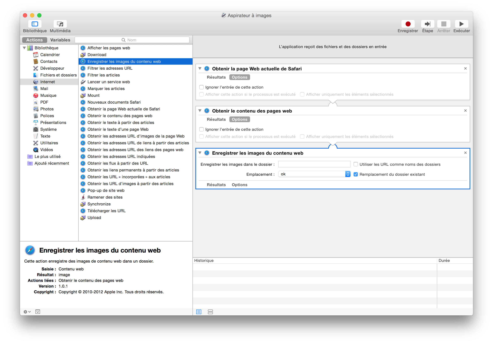
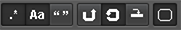
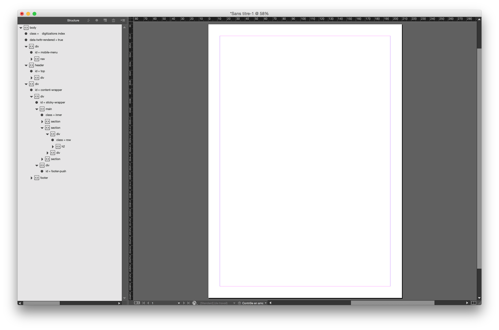
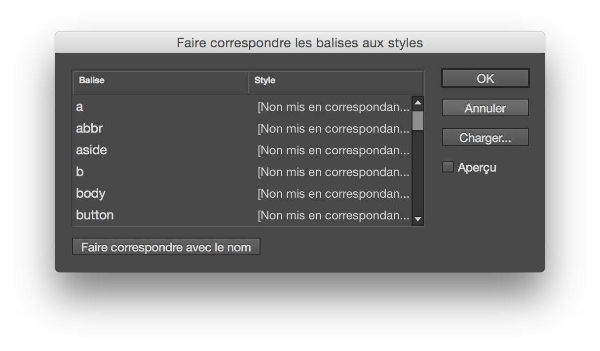
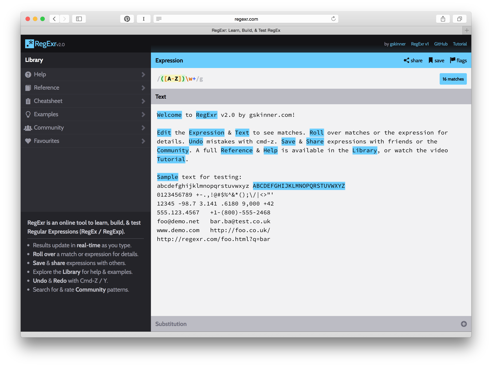
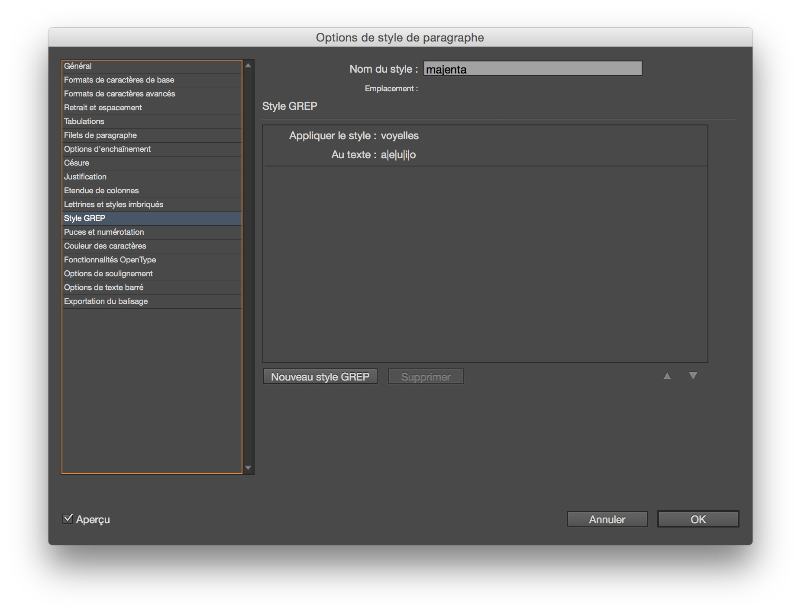

# leWeb.imprimer() #
Jérôme Saint-Loubert Bié, Loïc Horellou

###3e année 2e semestre :###

À partir d’un sujet proche de vos centres d’intérêts, vous concevrez un projet éditorial papier.
Celui-ci sera basé sur la récupération d’un corpus de textes et d’images conséquents issus d’un site web.
Les éléments textuels de menus et d’interfaces devront trouver leur place dans votre édition papier (à vous d’imaginer les systèmes de transposition de ces éléments sur un support imprimé : références croisées, index, sommaire, …).

Nous sommes actuellement dans une période de forte convergence des outils informatiques. Les outils de mise en page historiques (xPress, inDesign) permettent de plus en plus d’envisager de concevoir des projets sur écran (sites internet, projets éditoriaux pour tablettes tactiles, slideshow plus ou moins interactifs,…). D’un autre côté les langages de programmation Web prennent en compte de plus en plus de médiums et de supports différents (écran d’ordinateurs, mobiles, tactiles, projection, imprimé, …).

Ainsi votre projet devra obligatoirement respecter la structure HTML/XML de vos documents d’origine (en effectuant quelques adaptations si nécessaire). La maquette de l’édition sera issue de cette structure et mise en page dans indesign en utilisant obligatoirement un des outils de traitement automatique du logiciel. Quelques exemples de fonctionnalités utilisables:

- expression régulières (GREP)
- styles imbriqués
- scripts
- fonctionnalités open type dans une police de caractère

Le design devra être original (il ne doit surtout pas reprendre les codes graphiques du site d’origine), mais il devra être en adéquation avec le contenu proposé.
Le projet éditorial sera réalisé à échelle un et ne doit pas rester à l’état de principe ou de concept. Vous garderez une trace (carnets, processus, protocoles) du principe de mise en page automatique appliqué à votre contenu.

Pour la constitution de ce projet, vous produirez obligatoirement les éléments suivants :

- une note d’intention écrite
- des références bibliographiques et sitographiques
- des références visuelles 
- des éléments d’intention visuelle :
	- storyboard
	- arborescence
	- chemin de fer

Références :

- Open Source Publishing
- Wikipédia
- une maison d’édition dont j’ai mal noté le nom

## Récupérer le code source d'une page web ##

Pour récupérer le code HTML affiché sur une page web vous devez prendre garde à bien différencier 2 choses :

- le code source est constitué du code HTML+CSS+Javascript obtenu par votre navigateur internet une fois que vous avez renseigné une Url dans le champ d'adresse. Ce code peut se suffire à lui même, mais si il y a du javascript, il y a de fortes chances que ce code soit modifié juste avant d'être affiché
- L'arbre DOM est le code HTML qui est utilisé lors de l'affichage de la page dans votre navigateur une fois le javascript interprété et «rendu». C'est donc ce code que vous allez récupérer.

Pour ce faire, vous aller utiliser votre navigateur. Dans mon exemple j'utilise Safari, les procédures sont à peu prêt les mêmes dans Explorer, Chrome ou Firefox.
Une fois affichée votre page vous aller faire un clic droit et sélectionner l'item **Inspecter l'élément**

Vous aurez alors un tiroir contenant les différents outils de développement qui apparaîtra.

Juste au dessus du bloc contenant le code vous devez avoir un élément vous permettant de sélectionner soit le `code source` soit l'`Arbre DOM`. C'est cette dernière option qui nous intéresse.

Une fois sélectionné vous devriez avoir un système d'arborescence vous présentant les différentes imbrications du code HTML.

Dans le cadre du projet actuel, seul le code affiché, donc le code contenu dans la balise `body` nous intéresse. Vous pouvez donc cliquer sur `body` et faire un copier pour garder ce code en mémoire.

Ensuite vous pouvez ouvrir votre éditeur de code (dans mon cas il s'agit de [Sublime Text](http://www.sublimetext.com)), et vous collez le code de votre page (n'oubliez pas de spécifier qu'il s'agit de code HTML si vous souhaitez qu'il soit bien affiché en couleur). Comme ce fichier est destiné à inDesign qui refusera d'importer un fichier `HTML`, nous allons le sauvegarder au format `XML`. Cette action ce fait simplement en ajoutant l'extension `.xml` à notre fichier. On pourrait ainsi le nommer `code.xml`. Nous allons maintenant pouvoir télécharger les images de notre site, traiter le code et le nettoyer. Gardez également une copie du code sous forme de fichier `.html`.

## Récupérer les images ##

Pour récupérer les images, vous pouvez essayer de passer par un aspirateur de site internet comme [Site Sucker](http://www.sitesucker.us/mac/mac.html). Celui devrait aspirer tout le contenu de votre site,sauf les images qui sont hébergées sur d'autres serveurs (pour vérifier, l'url principale de vos images doit être la même que celle de votre site internet).
Pour éviter ce problème nous allons passer par l'outil nommé Automator créé par Apple (pour ceux qui sont sur PC il doit y avoir d'autres solutions).

Automator est un outil de script du système d'exploitation, qui fonctionne avec une interface nodale simplifiée. La programmation se fait à travers l'agencement d'une série de boites qui s'imbriquent les unes dans les autres.

Le script que nous allons réaliser va se composer d'une séquence de 3 actions :

1. Obtenir la page web actuelle de safari :  
On indique ici que l'on souhaite travailler avec la page de safari qui est actuellement consultée (n'oubliez pas d'ouvrir la page qui vous intéresse). Attention pour les sites qui ont un chargement d'images aléatoire, vous pouvez avoir une différence entre votre fichier de code archivé et le code de la page en cours de consultation. Pour éviter ce problème vous devriez pouvoir travailler avec le fichier source que vous avez archivé au format `.html`.
2. Obtenir le contenu des pages web  
On explique à automator qu'il va travailler avec le code contenu dans la page.
3. Enregistrer les images du contenu web  
Ici on va préciser dans le champ emplacement de la boite, le dossier dans lequel on va enregistrer les images. Vous placerez ce dossier dans le même répertoire que votre fichier xml.

## Nettoyer son code HTML pour qu'il soit bien compris par indesign ##

Sublime Text est un outil très puissant dès qu'il sait d'effectuer des sélections, de trouver des éléments et traiter de gros volumes de codes. 
Nous allons nous en servir pour :

- Nettoyer les balises qui ne sont pas fermées (balises img, input, ou autres sans / à la fin, ce qui est permis par la norme HTML5) :  
`` et pas ``  
`<input />` et pas `<input>`  
Si vous avez peur d'en oublier, ne vous inquiétez pas indesign vous fera des alertes d'erreur à l'importation
- Normaliser les liens vers les images :  
l'adresse des images (`` ou ``) pointent en général vers une adresse web. Ça ne sera pas compris par indesign. Il faudra alors faire correspondre l'adresse web au chemin de votre fichier par rapport au fichier xml et au dossier des images que vous aurez récupéré avec automator.
	- `http://nomdusite.com/adresse/de/image.jpg`
	- `file:///dossier_images/image.jpg`

Pour effectuer tous ces filtrages, le mieux est d'utiliser le fonction de recherches avancées de Sublime Text.
Voici une liste de raccourcis :
- `Ctrl + Cmd + g` : rechercher toutes les occurrences de la sélection, vous aurez ainsi un sélecteur de texte à chaque occurence trouvée, et vous pouvez toutes les éditer en même temps
- `alt + →` ou `alt + ←` : permet de se déplacer dans le code d'un mot à un autre
- `Cmd + f` : rechercher. Vous aurez un champ de recherche qui va apparaître avec à gauche une série de boutons. Le bouton le plus à gauche `.*` permet d'activer la recherche par expressions régulières. Par exemple pour trouver toutes les balises images, si ont souhaite les fermer, on va chercher : `()`. Si vous souhaitez nettoyer les commentaires HTML on va chercher `(<!--.*?)(-->)`.
Pour avoir plus d'information sur les expression régulières allez voir la section *Utiliser les expressions régulières dans les styles de paragraphes*.
 

## Importer son xml dans indesign ##

Lancez inDesign et créez un nouveau document. Ensuite allez dans  
**Fichier>Importation XML**  
et sélectionnez le fichier précédemment créé. Laissez les options d'importation par défaut.
Cette action aura pour effet de vous afficher la palette d'outil **Structure**, dans laquelle vous verrez toute votre arborescence. Si l'importation ne fonctionne pas, c'est qu'il doit y avoir une erreur dans votre fichier XML (le numéro de la ligne doit être indiqué).

Ensuite, il vous suffit de glisser la balise `body` visible dans la palette structure dans votre bloc de texte.

## Associer des styles de paragraphes aux balises html ##

Vous pouvez maintenant créer différents styles de paragraphe, et les associer aux balises de votre document XML.

Pour cela cliquez sur le bouton en haut à droite de la palette **Structure** et cliquez sur l'item **Faire correspondre les balises aux styles**.

Vous pourrez alors pointer un style pour chaque balise présente dans votre code. À noter que les styles de caractère, les styles de paragraphes et les styles de tableaux fonctionnent.

## Utiliser les expressions régulières dans les styles de paragraphes ##

Les expressions régulières sont un système de filtrage et de recherche de caractère assez complexes mais très puissants pour qui sait les manipuler. On peut ainsi rechercher dans une série de caractères (texte, code, etc) des éléments très particuliers à l'aide de caractères qui vont faire office de *motif* de recherche. On peut ainsi chercher un numéro de téléphone (français ou américain) ou encore trouver toutes les adresses mail dans un texte.

Pour bien comprendre comment ça fonctionne vous pouvez aller sur le site [Regexr.com](http://www.regexr.com). Celui ci vous permet de tester en temps direct des motifs d'expression régulière. Il dispose également de tout un tas d'exemple, d'un dictionnaire des caractères employés, et d'expressions régulières créées par des utilisateurs.

Dans Indesign les expression régulières s'utilisent via la palette GREP des styles de paragraphe ou via le champ de recherche. Il faudra auparavant créer des styles de caractères correspondants aux expression que vous souhaitez trouver et mettre en forme.

Une fois défini ces styles vous pouvez ajouter plusieurs styles GREP. Ceux-ci vont permettre d'appliquer des **styles de caractère** en fonction d'expression trouvées dans le texte où le **style de paragraphe** est appliqué.  
Dans la capture d'écran on applique à chaque voyelle le style de caractère *voyelles* au style de paragraphe *majenta*. Pour trouver les voyelles, on utiliser l'expression régulière `a|e|u|i|o`. La barre verticale correspond à *ou*.

Rappelle des raccourcis claviers pour les signes typographiques suivants sur mac :

- `Cmd + shift +` : `|` (barre verticale)
- `Alt + (` ou `Alt + )` : `{` ou `}`
- `Alt + shift + (` ou `Alt + shift +)` : `[` ou `]`

## Liens divers ##

- XML dans indesign : http://www.indesignusergroup.com/chapters/brisbane/files/643/Brisbane_Handout.pdf
- http://www.regexr.com
- https://packagecontrol.io/installation#st2

## Expressions régulières ##

#### Nettoyer les attributs HTML ####

**rechercher :** `&nbsp;?[\w:\-]+ ?= ?("[^"]+"|'[^']+'|\w+)`

**remplacer :** `rien`

#### Nettoyer les attributs HTML mais garder les références d'images et liens (href + src)####

**rechercher :** `<([a-z][a-z0-9]*)(?:[^>]*(\ssrc=['\"][^'\"]*['\"])|(\shref=['\"][^'\"]*['\"]))?[^>]*?(\/?)>`

**remplacer par :** `<$1$2$3>`

